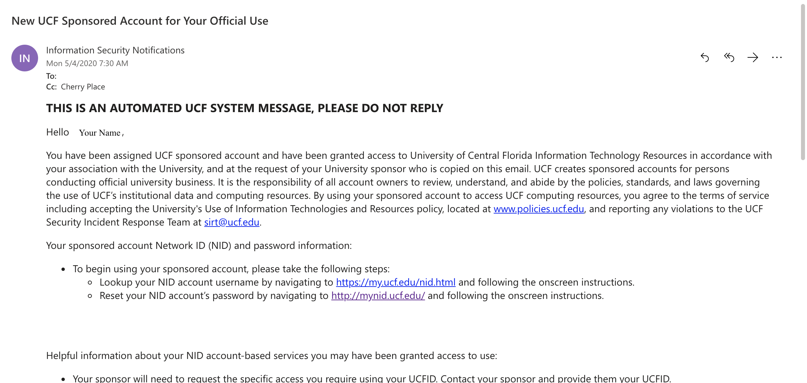
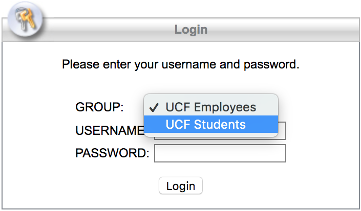
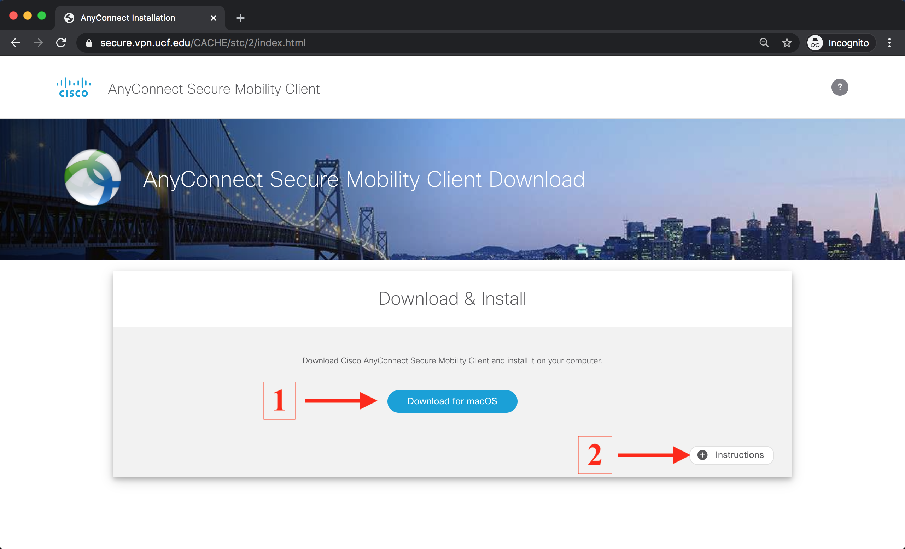
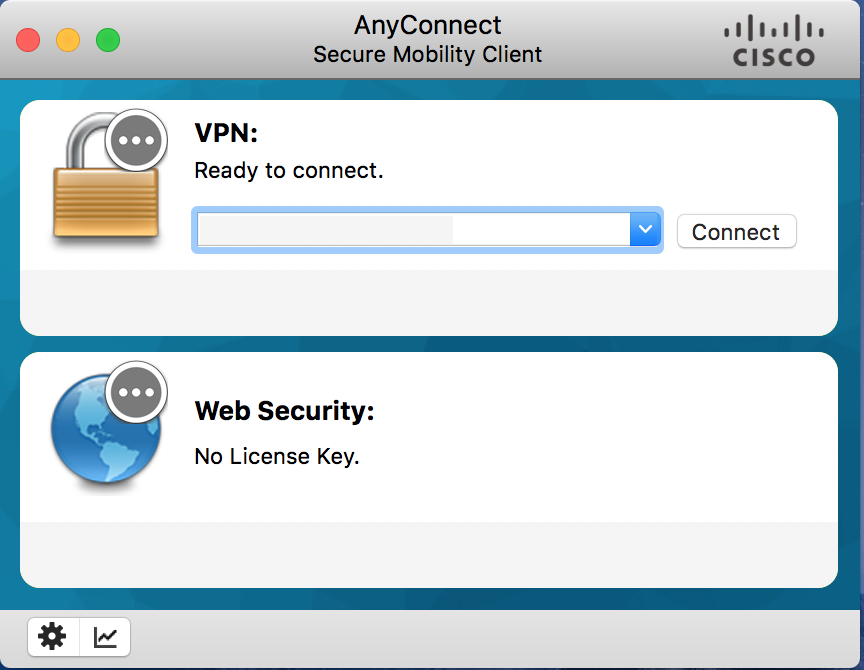

# How to Install UCF VPN

By using the UCF VPN, you will be able to access UCF resources which would normally require
you to be on campus connected to the UCF network (i.e. WiFi or Ethernet). In particular, while
using the UCF VPN, you will be able to login to UCF’s GPU cluster, referred to as Newton.

1. (Non-UCF Students) If you haven’t done so already, complete the setup for your UCF ID. Your 
   UCF ID will be of the form **xy123456**, or 2 letters followed by 6 numbers.
    The setup instructions can be found in your email (check Spam/Junk folders). The email
    should be from InfosecNotifications@ucf.edu and looks like the following:

<p align="center">
  
</p>

<p align="center">
  Figure 1. Email to Setup UCF ID for Non-UCF Students
</p>

2. Navigate to https://secure.vpn.ucf.edu. From the drop down menu, select “UCF Students” 
   as shown in **Figure 2** below. Enter your Username (UCF ID) and Password.

<p align="center">
  
</p>

<p align="center">
  Figure 2. Accessing VPN Download Page
</p>

3. On the following page, select “Continue” to UCF User Agreement. You will then be re-
    directed to a Download page. Select “Download for {Your OS}”, as shown in **Figure 3.1**.

<p align="center">
  
</p>

<p align="center">
  Figure 3. VPN Download Page & Instructions
</p>

4. Once you have downloaded the Cisco AnyConnect VPN, follow your OS’s on-screen prompts
    to complete the installation. There are additional instructions on the Download Page (See
    **Figure 3.2**) if necessary.
    
5. Once the installation is complete, open “Cisco AnyConnect Secure Mobility Client” on your
    machine. You should see a small login window as show in **Figure 4**. Type
    
    <p align="center">
      ```
      ucfvpn-1.vpn.ucf.edu
      ```
    </p>

    into the empty drop down field (directly to the left of “Connect”) and click “Connect”

    <p align="center">
      
    </p>

    <p align="center">
      Figure 4. Access UCF Network via VPN
    </p>

6. A login prompt will pop-up. As in Step 2, select “UCF Students” from the drop-down menu,
    and enter your Username(UCF ID) and Password. You should now be connected to the UCF
    VPN.


Notes: (a) For Troubleshooting FAQ’s, visit .

```
(b) The UCF VPN only “tunnels” traffic that has “.ucf.edu” in the URL. So for example,
if you check to see if your IP address has changed once connecting to the Client, it will
not reflect a change. However, for any “.ucf.edu” resource, it will appear as if your on
UCF’s Main Campus.
```

